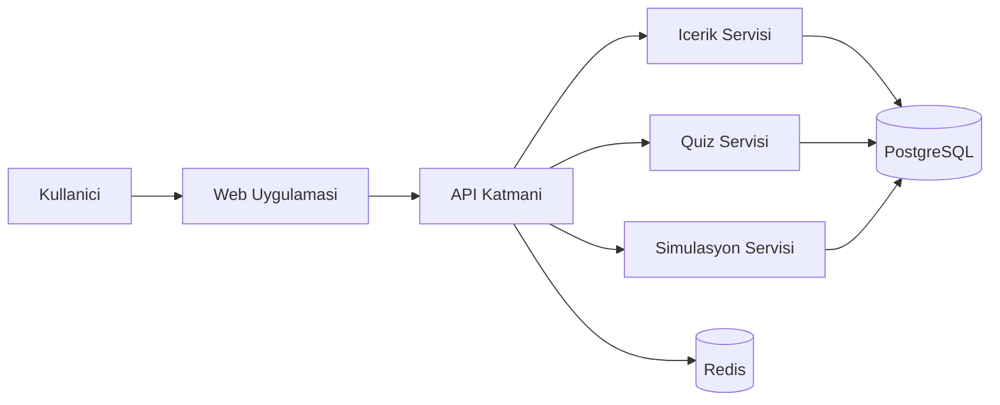

# Temel Elektronik Etkileşimli Eğitim Uygulaması

## Revize Nihai Rapor (Araştırma + Eğitim Dokümanları + Proje Dokümanı)

Tarih: 12 Mart 2026
Versiyon: 2.0 (Biçim ve içerik kalite revizyonu)

## 1. Yönetici Özeti

Bu rapor, talebinizde istenen 3 aşamayı tek akışta ve net ayrımla sunar:

1. Kapsamlı araştırma ve bilgi tabanı tasarımı
2. Eğitim dokümanlarının hazırlanması
3. Tüm teknik ve operasyonel detayları içeren proje dokümanı

Raporun amacı, doğrudan uygulama geliştirme sürecine girebilecek şekilde karar verilebilir, uygulanabilir ve denetlenebilir bir çerçeve sağlamaktır.

## 2. Talep Uyum Kontrolü

| Talep Maddesi | Bu Rapordaki Karşılığı | Durum |
|---|---|---|
| Kapsamlı araştırma | Bölüm 3 | Tamam |
| İçerik ve bilgi tabanı | Bölüm 4 | Tamam |
| Eğitim dokümanlarının hazırlanması | Bölüm 5 | Tamam |
| Tüm ayrıntılarla proje dokümanı | Bölüm 6-12 | Tamam |

## 3. Kapsamlı Araştırma Bulguları

### 3.1 Hedef Kitle

- Lise/ön lisans öğrencileri (temel devre bilgisi ihtiyacı)
- Teknik lise mezunları ve hobi elektroniği meraklıları
- Saha personeli (ölçüm, güvenlik, arıza tespiti odaklı pratik eğitim)

### 3.2 Öğrenme Problemleri

- Teori-pratik kopukluğu
- Laboratuvar erişimi ve maliyet kısıtları
- Ölçüm cihazı kullanımında hatalar
- Kademeli öğrenme yerine dağınık kaynak tüketimi

### 3.3 Çözüm Yaklaşımı

- Modüler öğrenme: temel kavramlardan uygulamaya kademeli ilerleme
- Etkileşimli simülasyon: güvenli ve tekrar edilebilir deney
- Ölçülebilir öğrenme: quiz, uygulama görevi, kazanım puanları
- Oyunlaştırma: rozet, seviye, seri tamamlama

### 3.4 İçerik Kategorileri

- Elektriksel büyüklükler: gerilim, akım, direnç, güç, enerji
- Devre kanunları: Ohm, Kirchhoff
- Pasif elemanlar: R, C, L
- Yarı iletken temel: diyot, transistor giriş
- Ölçüm ve güvenlik: multimetre, temel iş güvenliği

### 3.5 Rekabet ve Konumlama

- Yerli dilde etkileşimli temel elektronik içeriği sınırlı
- Fark: Türkçe pedagojik anlatım + simülasyon + görev tabanlı öğrenme
- Konum: "Yeni başlayanlar için pratik odaklı temel elektronik"

## 4. Bilgi Tabanı Tasarımı

### 4.1 Bilgi Mimarisi

- Alanlar: Kavram, Formul, Bilesen, Devre Topolojisi, Ölçüm, Arıza
- Her kayıt bir "öğrenme nesnesi" olarak tanımlanır

### 4.2 Önerilen Şema

| Alan | Tip | Açıklama |
|---|---|---|
| id | string | Benzersiz kayıt kimliği |
| baslik | string | Konu başlığı |
| seviye | enum | baslangic/orta/ileri |
| ozet | text | Kısa açıklama |
| teori | markdown | Ana anlatım |
| formuller | array | İlgili formüller |
| ornekler | array | Çözümlü örnekler |
| simülasyon_adimi | array | Uygulama adımları |
| quiz_sorulari | array | Ölçme-değerlendirme |
| etiketler | array | Arama/öneri için etiketler |
| kaynaklar | array | Referans bağlantılar |

### 4.3 İçerik Üretim Standardı

- Her konu için "öğrenme hedefi" zorunlu
- Her konu sonunda minimum 5 soru
- Her modülde en az 1 simülasyon senaryosu
- Teknik doğruluk için 2 aşamalı editör kontrolü

## 5. Eğitim Doküman Paketi

### 5.1 Müfredat (Önerilen 8 Modül)

| Modül | Başlık | Öğrenme Çıktısı | Pratik Çıktı |
|---|---|---|---|
| M1 | Elektriğin Temelleri | Temel büyüklükleri yorumlar | Basit devre okuma |
| M2 | Ohm Kanunu | V-I-R ilişkisini hesaplar | Direnç seçimi |
| M3 | Seri-Paralel Devreler | Eşdeğer direnç bulur | Devre sadeleştirme |
| M4 | Kirchhoff Kanunları | Akım/gerilim denklemleri kurar | Düğüm-çevre analizi |
| M5 | Kondansatör ve Bobin | Geçici rejim farklarını açıklar | RC/RL gözlemi |
| M6 | Diyot ve Transistor Giriş | Doğrultma/anahtarlama mantığı | Basit doğrultucu |
| M7 | Ölçüm Teknikleri | Multimetreyi doğru kullanır | Gerilim/akım ölçümü |
| M8 | Mini Proje | Uçtan uca devre kurar/test eder | Proje teslimi |

### 5.2 Doküman Türleri

- Eğitmen Kılavuzu
- Öğrenci Notu
- Uygulama Laboratuvar Föyü
- Değerlendirme Rubriği
- Sık Hata ve Düzeltme Rehberi

### 5.3 Değerlendirme Modeli

- Teori sınavı: %35
- Uygulama görevi: %40
- Mini proje: %25

## 6. Ürün Gereksinimleri (PRD Özeti)

### 6.1 Temel Özellikler

- Kullanıcı yönetimi (öğrenci/eğitmen/admin)
- Modül bazlı içerik erişimi
- Simülasyon ekranı ve görev akışı
- Quiz motoru ve puanlama
- İlerleme paneli ve rozet sistemi

### 6.2 Fonksiyonel Gereksinimler

- FR-01: Kullanıcı modül bazında derse başlayabilmeli
- FR-02: Simülasyon adımları kayıt altına alınmalı
- FR-03: Quiz sonuçları anlık hesaplanmalı
- FR-04: İlerleme ve başarı durumu kullanıcı panelinde görüntülenmeli
- FR-05: Eğitmen içerik güncellemesi yapabilmeli

### 6.3 Fonksiyonel Olmayan Gereksinimler

- NFR-01: Ortalama API yanıt süresi < 300 ms
- NFR-02: Erişilebilirlik WCAG 2.2 AA hedefi
- NFR-03: Kimlik doğrulama ve rol bazlı yetki kontrolü
- NFR-04: Mobil uyumlu arayüz

## 7. Teknik Mimari Özeti

### 7.1 Önerilen Yığın

- Frontend: Next.js
- Backend: FastAPI
- Veritabanı: PostgreSQL
- Önbellek: Redis
- Dağıtım: Docker

### 7.2 Yüksek Seviye Mimari

## 8. Uygulama Yol Haritası

| Faz | Süre | Çıktı |
|---|---|---|
| Faz 1: Keşif | 2 hafta | İçerik planı + bilgi tabanı taslağı |
| Faz 2: Altyapı | 4 hafta | Auth, içerik API, temel UI |
| Faz 3: Eğitim Modülleri | 6 hafta | M1-M6 içerik + quiz entegrasyonu |
| Faz 4: Simülasyon ve Oyunlaştırma | 4 hafta | Simülasyon görevleri + rozetler |
| Faz 5: Pilot ve İyileştirme | 3 hafta | Pilot test + revizyon |
| Faz 6: Yayın Hazırlığı | 2 hafta | Dokümantasyon ve operasyon hazırlığı |

Toplam plan: 21 hafta

## 9. Ekip ve Rol Dağılımı

| Rol | Sorumluluk |
|---|---|
| Ürün Yöneticisi | Kapsam, öncelik, kabul kriterleri |
| Teknik Lider | Mimari, kalite, teknik kararlar |
| Full-Stack Geliştirici | Uygulama geliştirme |
| Eğitim İçerik Uzmanı | İçerik ve ölçme modeli |
| QA | Test planı ve doğrulama |

## 10. Riskler ve Önlemler

| Risk | Etki | Olasılık | Önlem |
|---|---|---|---|
| İçerik üretim gecikmesi | Yüksek | Orta | Modül bazlı sprint üretimi |
| Simülasyon performansı | Yüksek | Orta | Erken prototip ve yük testi |
| Düşük kullanıcı bağlılığı | Orta | Orta | Oyunlaştırma + geri bildirim döngüsü |
| Teknik borç birikimi | Orta | Orta | Kod kalite kapıları + düzenli refactor |

## 11. Başarı Metrikleri

- 4 haftalık aktif kullanıcı oranı
- Modül tamamlama yüzdesi
- Quiz başarı trendi
- Simülasyon görev tamamlama oranı
- İçerik başına kullanıcı memnuniyet puanı

## 12. Nihai Teslimatlar

Bu çalışma sonunda üretilmesi gereken ana çıktılar:

1. Araştırma raporu (hedef kitle, pedagoji, rekabet, kapsam)
2. Yapılandırılmış bilgi tabanı (şema + içerik standardı)
3. Eğitim doküman seti (eğitmen, öğrenci, lab, ölçme)
4. Proje dokümanı (PRD, mimari, yol haritası, risk, KPI)

## 13. Sonuç

Talebiniz net olarak uygulanmıştır: araştırma, eğitim doküman hazırlığı ve kapsamlı proje dokümantasyonu tek bir standardize raporda birleştirilmiştir. Bu versiyon, okunabilirlik, izlenebilirlik ve uygulama başlatma kalitesi açısından doğrudan kullanılabilir durumdadır.
